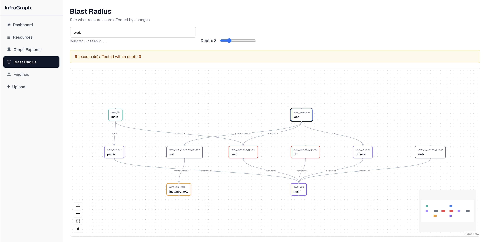

# InfraGraph

**Open-source cloud dependency mapper.** Upload Terraform plan or state JSON files and get an interactive graph of your infrastructure — with blast radius analysis, drift detection, and security findings.

[](https://github.com/alfonsomeraz/infragraph/actions/workflows/ci.yml)
[](LICENSE)
[](CHANGELOG.md)



---

## Features

- **Graph visualization** — interactive React Flow canvas showing resource dependencies
- **Blast radius** — select any resource and see what would be affected by a change
- **Findings engine** — auto-detect orphaned resources, security exposures, circular dependencies, and critical nodes
- **Drift detection** — surface resources with uncommitted changes from Terraform plans
- **Multi-source** — supports Terraform plan JSON, Terraform state JSON

---

## Quick start

**Requirements:** Docker + Docker Compose (or Python 3.11+ and Node 20+ for local dev)

```bash
# Clone
git clone https://github.com/alfonsomeraz/infragraph.git
cd infragraph

# Start everything (Postgres + API + Frontend)
docker compose up --build

# In a second terminal, run migrations
docker compose run --rm migrate
```

Then open **http://localhost:3000** and upload one of the example files from `examples/`.

> **Troubleshooting:** If the frontend shows "API 500" or a connection error, make sure all services are up with `docker compose ps` and run `docker compose run --rm migrate` if you haven't already.

---

## Development setup

### Backend (Python / FastAPI)

```bash
# Create venv and install all deps (including dev/test)
make install

# Start Postgres
docker compose up -d postgres

# Run migrations
make migrate

# Start API with hot-reload on :8000
make dev

# Run all tests
make test

# Lint / format
make lint
make format
```

### Frontend (Next.js)

```bash
# Install deps
make fe-install

# Start dev server on :3000 (requires API running)
make fe-dev

# Production build
make fe-build
```

### CLI

```bash
# Install CLI into the backend venv
make cli-install

# Check available commands
backend/.venv/bin/infragraph --help

# With API running (make dev):
backend/.venv/bin/infragraph ingest upload examples/terraform-plan.json
backend/.venv/bin/infragraph resources list
backend/.venv/bin/infragraph resources list --type aws_instance
backend/.venv/bin/infragraph scan
backend/.venv/bin/infragraph findings list --severity high
backend/.venv/bin/infragraph blast-radius <resource_id> --depth 3
backend/.venv/bin/infragraph graph graph <resource_id>
```

Override the API URL with an env var or flag:

```bash
INFRAGRAPH_API_URL=https://my-deployment.example.com backend/.venv/bin/infragraph resources list
# or
backend/.venv/bin/infragraph --api-url https://my-deployment.example.com resources list
```

### Seed with example data

```bash
make seed
```

This uploads the Terraform files in `examples/` and runs the findings scanner.

To test the **findings engine** specifically, upload `examples/terraform-plan-findings.json` — it contains drift changes, unencrypted resources, an open security group, an orphaned CloudWatch log group, and a high-degree security group that will trigger all five detectors.

---

## API reference

Interactive docs are available at **http://localhost:8000/docs** when the API is running.

| Endpoint | Description |
|----------|-------------|
| `POST /api/ingest/upload` | Upload a Terraform plan or state JSON file |
| `GET /api/resources` | List resources (filter by type, provider, source) |
| `GET /api/graph/{resource_id}` | Full dependency graph for a resource |
| `GET /api/graph/{resource_id}/blast-radius` | Blast radius subgraph (depth 1–10) |
| `GET /api/findings` | List findings (filter by type, severity) |
| `POST /api/findings/scan` | Run the findings detector |

---

## Project structure

```
infragraph/
├── backend/                 # Python / FastAPI
│   ├── app/
│   │   ├── adapters/terraform/  # Plan + state parsers, reference resolver
│   │   ├── db/              # SQLAlchemy models, session
│   │   ├── routes/          # FastAPI routers
│   │   ├── schemas/         # Pydantic request/response models
│   │   └── services/        # Business logic (ingest, graph, findings)
│   └── tests/
├── cli/                     # Typer CLI (infragraph)
│   └── infragraph_cli/
│       ├── commands/        # ingest, resources, graph, findings
│       ├── client.py        # httpx wrapper
│       └── output.py        # Rich formatters
├── frontend/                # Next.js 16 + React Flow
│   └── src/
│       ├── app/             # Pages (dashboard, graph, blast-radius, findings, upload)
│       ├── components/      # Shared UI + graph components
│       └── lib/             # API client, types, constants
├── infra/
│   ├── docker/              # Dockerfiles
│   └── scripts/             # seed.sh
├── examples/                # Sample Terraform plan + state JSON files
└── docs/                    # Architecture and deployment guides
```

---

## Tech stack

| Layer | Technology |
|-------|-----------|
| Backend | Python 3.11+, FastAPI, SQLAlchemy 2.0 (async), asyncpg |
| Database | PostgreSQL 16 |
| Frontend | Next.js 16, React Flow v12, Tailwind CSS |
| Migrations | Alembic |
| Testing | pytest, pytest-asyncio |
| Lint | ruff (backend), ESLint (frontend) |
| CI | GitHub Actions |

---

## Documentation

- [Architecture overview](docs/architecture.md) — data model, services, adapters, data flow
- [Deployment guide](docs/deployment.md) — Docker Compose, TLS, production considerations
- [Changelog](CHANGELOG.md) — version history
- [Security policy](SECURITY.md) — vulnerability reporting

## Versioning & Releases

InfraGraph uses **semantic versioning** (MAJOR.MINOR.PATCH). All version numbers are synchronized across:
- `VERSION` file
- `backend/pyproject.toml`
- `cli/pyproject.toml`
- `frontend/package.json`

### Bumping the version

```bash
bash infra/scripts/bump-version.sh 0.2.0
# Updates all version files
```

Then:

1. Update `CHANGELOG.md` with the new version and changes
2. Commit: `git add -A && git commit -m 'Bump version to 0.2.0'`
3. Tag: `git tag -a v0.2.0 -m 'Release v0.2.0'`
4. Push: `git push origin main && git push origin v0.2.0`

On tag push, GitHub Actions will:
- Run full CI (lint, migrate, tests, frontend build)
- Build and push Docker images to GHCR as `ghcr.io/alfonsomeraz/infragraph/api:0.2.0` and `:latest`
- Create a GitHub Release with CHANGELOG notes

## Contributing

Contributions are welcome! See [CONTRIBUTING.md](CONTRIBUTING.md) for guidelines.

**Good first issues** are tagged [`good first issue`](https://github.com/alfonsomeraz/infragraph/issues?q=is%3Aopen+label%3A%22good+first+issue%22) on GitHub.

---

## License

[MIT](LICENSE) — © 2026 InfraGraph Contributors
